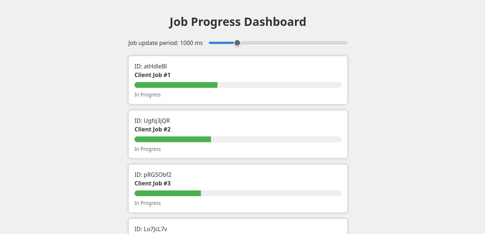

# Job Progress Dashboard

Let me introduce you the small demonstration of how to approach frontend architecture, state management, and component design using React (with TypeScript). The challenge was to create a small one-page React application that connects to a WebSocket server (already set up and running) and displays real-time job progress updates. Enjoy!




## Getting Started

```bash
npm install
```

Run the development server:

```bash
npm start
```

Open [http://localhost:3000](http://localhost:3000) with your browser to see the result.

## Technologies used

**React 19**

The latest version of React was used for building the UI. However React 19 currently has some limitations with signal-based reactivity, which required adding a small workaround in the `JobList` component to ensure updates propagate correctly. This workaround results in slightly more re-renders of `JobList` than ideal. Alternative would be downgrading to older versions of React.

**TypeScript**

For static type checking and improved code quality TS was used with strict configuration to ensure best possible results.

**Native WebSocket API**

Used for real-time communication with the backend server to receive job progress updates. Also automatic-reconnection was added to current implementation, with maximum number of attempts set to `5`.

**React hooks**

Custom hooks like `useWebSocket` and `useHandleJob` encapsulate logic for WebSocket management and message batching in case of rapid amount of incoming messages, to prevent performance issues.

**@preact/signals-react**

Signals were used to experiment with fine-grained reactivity and to reduce unnecessary re-renders. In practice, signals provided only a modest improvement in re-render reduction (notably for the period slider as an extra bonus to this project). For most of the app, traditional `useState` and `React.memo` would be sufficient.

In case new React Compiler already worked as promised regarding new memoization optimization features, using `React.memo` higher order component wouldn't be needed for used `JobCard` component anymore.

**Potential for Zustand**

For larger or more complex projects, or to further limit re-renders (especially in `JobList`), a state management library like Zustand could offer more scalable and optimized state handling. For this small app, it would be overkill.

Other alternatives include using Preact, removing the signals workaround when possible, or optimizing object reference updates to avoid unnecessary re-renders, though immutability is generally best practice for predictability and performance.

Less standard options involve creating a signal for each job or giving each `JobCard` direct access to a shared WebSocket connection to check if the incoming update is related to its specific job data or not. However React encourages top-down data flow and centralized state management.

**ESLint**

Adding ESLint support helped enhance the overall code quality.

## More

_"When a job is completed, it should remain in the list for 5 seconds and then disappear"_

There are two approaches I've realized that could be applied to this particular subtask:

**A. Removing the job from jobsSignal**

_Pros:_

- the job is truly gone from our state, so it won’t be rendered or processed anywhere else
- keeps state clean and in sync with the UI

_Cons:_

- if we need to show completed jobs elsewhere (e.g., in a history or log), we lose that data unless we store it somewhere else

**B. Conditionally rendering nothing after 5 seconds**

_Pros:_

- the job data remains in state, we can use it for history, analytics, etc.
- simpler if wanting to keep completed jobs for other purposes

_Cons:_

- the job still exists in memory/state, which could be a problem if we had many jobs and never clean them up

For our current implementation, the **A option** was chosen. We didn't need the data anywhere else so it didn't make sense to keep them in state after disappearing from the job list.

## Further Improvements

More possible improvements could include:

- **WebSocket reconnection improvements:**

  - Implement exponential backoff for reconnection attempts, so that if the server is unavailable, the delay between reconnects increases, reducing unnecessary network traffic and server load.
  - For more advanced WebSocket features consider using established libraries like [React useWebSocket](https://github.com/robtaussig/react-use-websocket) or [Socket.IO](https://socket.io/).

- **Improve error handling and user feedback:**

  - Track and display the WebSocket connection status in the UI, so the users are aware of any issues. Add UI notifications for WebSocket connection errors, reconnection attempts, or when the maximum number of reconnects is reached.

- **Job history and analytics:**

  - Implement a feature to keep and display completed jobs in a history/log section, rather than removing them from state entirely.

- **Testing:**

  - Add unit and integration tests for hooks (`useWebSocket`) and components to ensure reliability, especially under rapid message loads.

- **Accessibility:**
  - Enhance accessibility by improving keyboard navigation, screen reader support for job lists and controls.
